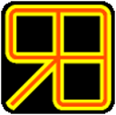

===========
battle-rage
===========

Introduction
------------

``battle-rage`` is a fighting game, with terrible duels fights, *so that the battle rages on* **!**

Either:

+ **Player** vs **Computer**.

+ **Player** vs **Player**.

+ **Computer** vs **Computer**.

.. image:: ./battle-rage_presentation_screen.png

Fighters
--------

``battle-rage`` provides 16 different fighters,

all having different properties and sort of kicks:

+ Fuuma

    .. image:: ./Fuuma.png

+ Geese Howard
    
    .. image:: ./Geese_Howard.png    
        
+ Hanzo

    .. image:: ./Hanzo.png

+ Hotaru Futaba

    .. image:: ./Hotaru_Futaba.png

+ Iori Yagami

    .. image:: ./Iori_Yagami.png

+ Kim Kaphwan

    .. image:: ./Kim_Kaphwan.png

+ Kisarah Westfield

    .. image:: ./Kisarah_Westfield.png

+ K

    .. image:: ./K.png

+ Kyo Kusanagi

    .. image:: ./Kyo_Kusanagi.png

+ Lee Pai Long

    .. image:: ./Lee_Pai_Long.png

+ Mai Shiranui

    .. image:: ./Mai_Shiranui.png

+ Mr Big

    .. image:: ./Mr_Big.png

+ Mr Karate

    .. image:: ./Mr_Karate.png

+ Robert Garcia

    .. image:: ./Robert_Garcia.png

+ Rock Howard

    .. image:: ./Rock_Howard.png

+ Terry Bogard

    .. image:: ./Terry_Bogard.png
    
Fighters properties
~~~~~~~~~~~~~~~~~~~

All fighters have some properties:

    + Speed
    
        The speed indicate the speed the fighter moves **forward** or **backward**.

        And how much *(speed / 3.75)* the fighter **advance** in direction to the **adversary** when he **give a kick**.

        :note: The **speed** values are comprise between: [**10**-**15**].
    
    + Aggressiveness
    
        This property is only take into account when the fighter is the computer.

        And indicate how aggressive the fighter is.
        
        :note: The aggressiveness value is a percent.
    
    + Force
    
        The force indicate how much damage the fighter inflict to his adversary minus the adversary resistance.

        :note: The fighter force is comprise between [**0.80**-**1.30**].
    
    + Resistance 
    
        The fighter resistance indicate how much life points the fighter he will lose when he receive a kick.

        :note: The resistance value is comprise between: [**0.75**-**1.25**].

        Note: When the fighter kick the ass of his adversary and this one is not protected

        The life points from the adversary are reduce in this manner:

        ::        
            
            ([Value of the kick] × [force]) - ([Resistance common value] × [resistance]) ;
            
            
Joystick(s) logic of battle-rage
--------------------------------

Joystick(s) plan:
~~~~~~~~~~~~~~~~~

    .. image:: ./joystick_battle-rage.png

battle-rage joystick usage
~~~~~~~~~~~~~~~~~~~~~~~~~~

    For playing battle-rage you only need the the **4** buttons A, B, X and Y and a **directional pad** (stick).

    The button at the top of the joystick (RF, RB, LF, LB) aren’t used.

    You can use the **digital** stick (*directional pad*), *which is recommanded*, as well as the **analogical** stick.

    :warning: I can’t guarantee you that you can use twice stick at the same time once your joystick configured.
    
battle-rage and his joystick rules
~~~~~~~~~~~~~~~~~~~~~~~~~~~~~~~~~~

    battle-rage has some rules for playing with the joystick.

    According to the fact that you have **2 hands** and **2 foots** (exclude for the physic handicap).
    
    battle-rage follow **the same logic** for the *joystick* buttons *logic*:
    
        + The **back hand** from your fighter is **activate** by pressing the ``A`` button from the *joystick*.
        
        + The **front hand** from your fighter is **activate** by pressing the ``X`` button from the *joystick*.
        
        + The **front foot** from your fighter is **activate** by pressing the ``B`` button from the *joystick*.
        
        + The **back foot** from your fighter is **activate** by pressing the ``Y`` button from the *joystick*. 
    
    
    :note: You can sea that like a cross which **X** axis is are the foots and the **Y** axis the hands.
    
    You can use **combinations** by adding a direction from the **directional keypad** to the used button.
    
    This will generate different kicks for every combination.
    
    **Finally** all combination make sens, **per example**:
    
        Pressing the **Up** arrow and an **hand button** will produce an **uppercut**,
    
        and pressing the :**Back arrow** and a **foot kick** will produce a **return foot kick**.
        
The different joysticks models handling
~~~~~~~~~~~~~~~~~~~~~~~~~~~~~~~~~~~~~~~

    ``battle-rage`` doesn’t claim to take in charge every different joystick model of the world but:

    .. note:: battle-rage does the best for taking in charge the most of different joystick models.

        And you must pass through a *joystick configuration phase*, which is oblige,

        every time you *plug a new joystick model*.

        **Not** every time you plug your(s) *joystick* to **play the game** !

        :warning: To know that every time you plug a new joystick model you will have to configure it.

        That’s better for all: the game logic, you, conversation about battle rage,...

        Because it permit to set a precise combination set, not in according different joysticks models mess, 
        
        but according to the game.
        
Advice:
~~~~~~~

    You must better plug the joystick before starting the game.

    Else you will be notify about the problem and be invited to plug a joystick before really starting the game.

    And if you plan to play with 2 users plug 2 joystick before gaming.

    But you if you don’t have plug 2 joysticks you will be invited to do so...

    **Sorry** but my *joystick handler* doesn’t handle the plug-in plug-off of *joysticks*.

    so the free hot plug of *joystick(s)* is not permit with ``battle-rage``.
    
battle-rage fighting
--------------------

Introduction:
~~~~~~~~~~~~~

    All fighters have a common set of kicks in relationship

    to the joystick button with or without a direction button, on the directional pad from your joystick:

    joystick_battle-rage

    + The **back hand** from your fighter is **activate** by pressing the ``A`` button from the *joystick*.
    
    + The **front hand** from your fighter is **activate** by pressing the ``X`` button from the *joystick*.
    
    + The **front leg** from your fighter is **activate** by pressing the ``B`` button from the *joystick*.
    
    + The **back leg** from your fighter is **activate** by pressing the ``Y`` button from the *joystick*. 

    :note: So you get the following different combinations:
    

Simple **combinations**:
~~~~~~~~~~~~~~~~~~~~~~~~

    + Only ``A``: a **back hand** kick.
    
    + Only ``X``: a **front hand** kick.
    
    + Only ``B``: a **back leg** kick.
    
    + Only ``Y``: a **front leg** kick.
    
    + Only ``→``: the fighter **moves** in direction **right**.
    
    + Only ``←``: the fighter **moves** in direction **left**.
    
    + Only ``↓``: the fighter goes **down**: on his knees. 

    :note: The ``↑`` is not used for jumping: some combination makes the fighter jumping.

Direction + Button **combinations**:
~~~~~~~~~~~~~~~~~~~~~~~~~~~~~~~~~~~~

**back hand** kicks:
++++++++++++++++++++

    + ``→`` **+** A: a big **back hand** kick.
    
    + ``←`` **+** A: protected in standing.
    
    + ``↑`` **+** A: a **back hand** uppercut.
    
    + ``↓`` **+** A: protected on knees. 

**front hand** kicks:
+++++++++++++++++++++

    + ``→`` **+** X: a big **front hand** kick.
    
    + ``←`` **+** X: a returned **front hand** kick.
    
    + ``↑`` **+** X: a **front hand** uppercut.
    
    + ``↓`` **+** X: a **front hand** kick to knees. 

**front foot** kicks:
+++++++++++++++++++++

    + ``→`` **+** B: a **front foot** kick to body.
    
    + ``←`` **+** B: a returned **front foot** kick.
    
    + ``↑`` **+** B: a **front foot** kick to head.
    
    + ``↓`` **+** B: a **front foot** kick to knees. 

**back foot** kicks:
++++++++++++++++++++

    + ``→`` **+** Y: a **back foot** kick to body.
    
    + ``←`` **+** Y: a returned **back foot** kick.
    
    + ``↑`` **+** Y: a **back foot** kick to head.
    
    + ``↓`` **+** Y: a **back foot** kick to knees. 

    .. warning:: because nothing is perfect it can happen that a combination don’t really

        represent what it should like explain above.

        But **I guarantee** that it really **doesn’t happen often** and that the replacement **is near from your expecting**.
    
        And some kicks have fallbacks: this mean that 2 different combination can give the same kick: not often.
    
        All according the fighter.